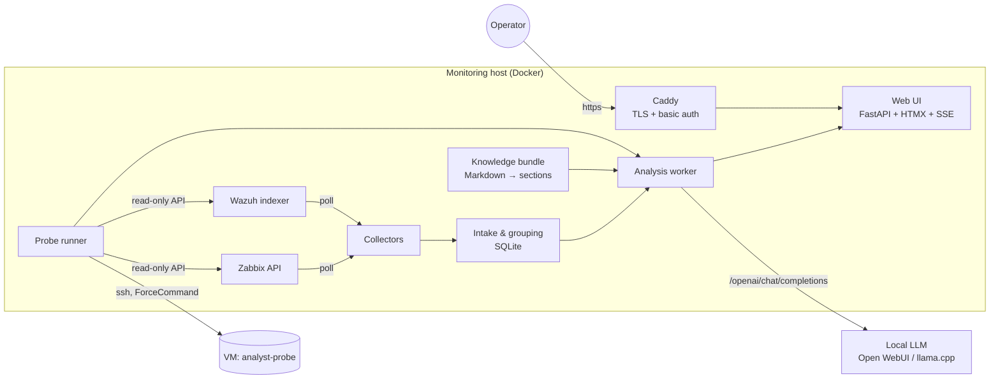

# LLM Incident Analyst

**LLM Incident Analyst** (package `tia`) collects alerts from Zabbix and Wazuh, groups them into incidents, runs a small set of *read-only* probes against the affected hosts, and asks a **local LLM** (any OpenAI-compatible chat endpoint, e.g. llama.cpp behind Open WebUI) to explain what is probably going on. Results are shown on a single web page. The analyser only *proposes*; every decision and every change stays with a human.

## Architecture



---

### Who it is for

Small operations teams that already run Zabbix and Wazuh in containers, keep an operations manual in Markdown, and have (or can borrow) a GPU box that serves an OpenAI-compatible endpoint. The whole thing is one container on the monitoring host plus a locked-down SSH user on each probed VM.

> **Language note.** Code comments, log messages, the web UI and the LLM prompts are written in **Japanese**, because the tool was built for a Japanese-speaking operations team. Identifiers, configuration keys and the documents under `docs/` are in English. Contributions that add an English UI are welcome (see [CONTRIBUTING.md](CONTRIBUTING.md)).

### How it works

* **Collectors** poll Zabbix (`problem.get`) and the Wazuh indexer, with watermarks, overlap and back-off.
* **Intake** normalises alerts, classifies them by type (`config/type-rules.yaml`), detects recurrences, follow-ups and alert storms, and groups them into incidents.
* **Knowledge** turns your own operations manual (Markdown) into a *bundle*: an *environment card* plus sections selected per incident by host alias and alert type. Every build is scanned for secrets.
* **Probes** run a fixed catalogue of read-only commands on the affected VM through a dedicated SSH user whose shell is replaced by an executor (`ForceCommand`), plus read-only Zabbix/Wazuh queries. Output is passed to the LLM as `<probe_data>`.
* **Analysis** builds a budgeted prompt (rules, card, sections, history, statistics, probe output), calls the LLM, validates the JSON answer, excludes destructive commands from the recommendations, and stores the result.
* **Web UI** lists incidents, streams progress over SSE, lets operators run probes on demand, give feedback and register cases that feed future analyses.
* **Ops**: single-process service (`tia run`), nightly backup, retention housekeeping, health endpoint.

Details: [docs/architecture.md](docs/architecture.md).

### Requirements

| Component | Version |
|---|---|
| Python | 3.12+ (3.13 in CI and in the container image) |
| [uv](https://docs.astral.sh/uv/) | any recent |
| Zabbix | 6.x/7.x API with a read-only API token |
| Wazuh | 4.x indexer (OpenSearch API) with a read-only user |
| LLM | any OpenAI-compatible `chat/completions` endpoint that supports `response_format` with a JSON schema; tested with llama.cpp behind Open WebUI (`/openai` route) |
| Docker + Compose | for the container image, the local stack and some tests |
| OpenSSH | client on the monitoring host, server on probed VMs |

### Quick start (local stack, no real systems)

```bash
git clone git@github.com:tnbt1/llm-incident-analyst.git && cd llm-incident-analyst
uv sync
uv run pytest                     # ~2.5 min; Docker/Chromium tests skip when unavailable

# Fake Zabbix, Wazuh, LLM and a stand-in VM, plus the real image:
tools/local-stack.sh up           # build the knowledge bundle from examples/, build images, start
tools/local-stack.sh inject 3     # push 3 fake alerts to each source
tools/local-stack.sh check        # wait for /healthz and list incidents (expects "done")
tools/local-stack.sh probes       # probe results recorded against the stand-in VM
open http://127.0.0.1:38090/      # web UI (no auth in the local stack)
tools/local-stack.sh down
```

Without Docker you can still run the pieces:

```bash
uv run tia knowledge build --source examples/knowledge-source --out config/knowledge --recipe config/knowledge.yaml
uv run tia ingest --db tia.sqlite --source zabbix --file tests/fixtures/zabbix_problems.json
uv run tia list --db tia.sqlite
uv run python tools/fake-llm.py --port 18090 --key-file /tmp/tia-key &
TIA_LLM_URL=http://127.0.0.1:18090/openai TIA_LLM_API_KEY_FILE=/tmp/tia-key uv run tia analyze --db tia.sqlite --knowledge config/knowledge --once
uv run tia web --db tia.sqlite --knowledge config/knowledge   # http://127.0.0.1:8000
```

`uv run tia --help` lists all commands: `knowledge`, `ingest`, `list`, `collect`, `analyze`, `show`, `web`, `run`, `housekeeping`, `backup`, `restore`.

### Adapting it to your environment

1. Replace `examples/knowledge-source/` with your own operations manual (Markdown) and align `files`, `card.sections` and `hosts` in `config/knowledge.yaml` ([docs/knowledge.md](docs/knowledge.md)).
2. List the probed VMs under `hosts` in `config/probes.yaml` (Zabbix host name, IP, guest-firewall table, Compose file, roles).
3. Install the probe user `analyst-probe` on each VM ([docs/probes.md](docs/probes.md)).
4. Edit the addresses in `deploy/compose.yaml` and `deploy/caddy/site.caddy`, and place the secrets as described in `deploy/secrets/README.md` ([docs/deployment.md](docs/deployment.md)).
5. Tune `config/analyzer.yaml`: at least `grouping.root_host`, `llm.model`, `llm.context_tokens` and `web.system_name`.

### Configuration

Everything that is not a secret or an endpoint lives in `config/analyzer.yaml` (one section per subsystem; unknown keys and out-of-range values are rejected at start-up). **Every setting can also be overridden from the environment or a `.env` file**, so a deployment can change one value without editing the YAML:

* Name rule: `section.key` → `TIA_SECTION_KEY`. `zabbix.min_severity` becomes `TIA_ZABBIX_MIN_SEVERITY`; lists are comma-separated (`TIA_QUEUE_RETRY_DELAYS_SEC=60,300,900`); booleans accept `true/false/yes/no/on/off/1/0`.
* Precedence: process environment > `.env` > `analyzer.yaml` > built-in defaults. The `.env` file is `TIA_ENV_FILE` if set, otherwise `.env` next to the YAML. With Compose, `deploy/compose.yaml` passes the `.env` next to it through `env_file` (optional); Compose itself reads `TIA_IMAGE_TAG` from the same file.
* Wrong values stop start-up and name the variable: `設定の誤り: TIA_ZABBIX_MIN_SEVERITY は 0 から 5 の整数で書く: 9`.
* `tia config show --config config/analyzer.yaml` prints every setting with its value and source (`default`, `yaml`, `.env`, `env`), masking values whose name says key/token/password/secret (file paths are shown). `tia config env-template` prints the fully commented template; the committed [`.env.example`](.env.example) is generated by it and a test keeps it in sync with the code.

Endpoints and secrets keep their existing variable names (they are also accepted in `.env`) and come from file secrets:

| Variable | Meaning |
|---|---|
| `TIA_ZABBIX_URL`, `TIA_ZABBIX_TOKEN_FILE` | Zabbix JSON-RPC URL and the file holding a read-only API token |
| `TIA_WAZUH_URL`, `TIA_WAZUH_USER`, `TIA_WAZUH_PASSWORD_FILE`, `TIA_WAZUH_CA_FILE` | Wazuh indexer URL, read-only user, password file, CA file |
| `TIA_LLM_URL`, `TIA_LLM_API_KEY_FILE`, `TIA_LLM_MODEL` | OpenAI-compatible base URL (ending in `/openai` for Open WebUI), API key file, model name (`TIA_LLM_MODEL` is simply the override of `llm.model` under the name rule) |
| `TIA_PROBE_SSH_BIN` | alternative `ssh` binary (tests only) |
| `TIA_ENV_FILE` | path of the `.env` file to read (default: `.env` next to `analyzer.yaml`) |

Main sections of `config/analyzer.yaml`:

| Section | What it controls |
|---|---|
| `knowledge` | source dir, bundle dir, recipe, selection vs. full mode, token budgets, staleness |
| `zabbix`, `wazuh` | severity/level thresholds, named rules, hold time, poll interval, paging |
| `intake`, `grouping` | recurrence/follow-up windows, storm detection, `root_host` (the router whose outage explains everything else) |
| `collector`, `queue`, `worker` | timeouts, back-off, retry delays |
| `llm`, `context` | model, temperature, `max_tokens`, context length, per-part token budgets |
| `web` | bind address/port, **`system_name`** shown in the UI, timezone, SSE timing, cookie flags |
| `retention`, `backup`, `housekeeping` | retention days, backup generations and schedule |
| `probes` | enable, SSH user, catalogue, known_hosts, key file, time budget |

Other files: `config/type-rules.yaml` (alert → incident type), `config/knowledge.yaml` (how to build the bundle, host aliases), `config/probes.yaml` (host inventory and probe catalogue).

### Security model (summary)

* The analyser **never changes anything**. Recommended commands are parsed (including the inner command of `docker exec`, `ssh`, `sh -c`, `xargs`…) and checked against a destructive-command list; commands found in your own manual are marked as *documented*.
* Probes run as a dedicated SSH user whose login is restricted to `publickey`, with `ForceCommand` pointing at an executor that accepts **one probe name** and runs a **fixed argv** without a shell; `sudo -n` is limited to the exact read-only commands in `deploy/sudoers/analyst-probe`. No TTY, no forwarding.
* The LLM only sees text inside `<alert_data>`, `<probe_data>`, `<env_card>`, `<doc>`; the prompt tells it to treat these as data, and the answer is validated against a JSON schema.
* The knowledge build scans every line for secrets (keys, tokens, passwords, hashes) and refuses to build unless a line is explicitly allow-listed by hash.
* The container runs as uid 10001, read-only root FS, `cap_drop: ALL`, `no-new-privileges`, with file-based secrets. Only Caddy (TLS + basic auth) is exposed.

Reporting: [SECURITY.md](SECURITY.md).

### Operations

| Task | How |
|---|---|
| Run | one container (`deploy/compose.yaml`), `tia run` inside; `/healthz` answers 200 when ready, 503 while starting or degraded |
| Update the knowledge | rebuild the bundle on your workstation, copy it to the host; the service picks it up within `knowledge.reload_check_sec` |
| Backup | nightly `tia backup` (SQLite copy + config + bundle, with manifest); `tia restore` with the service stopped |
| Housekeeping | `tia housekeeping` applies `retention.*` (payload, incident and skipped-alert days) |
| Update the image | `tools/image-build.sh <version>`, `docker load`, `TIA_IMAGE_TAG=<version> docker compose up -d`; migrations run at start-up |
| Watch it | an HTTP monitor on `/healthz` (e.g. Uptime Kuma) and Docker `HEALTHCHECK` |

Full procedure: [docs/deployment.md](docs/deployment.md).

### Limitations

* One prompt, one answer per analysis: there is no tool-calling loop. Stage-1 probes run before inference; further probes are run by the operator from the UI.
* Token budgets are estimated with a linear model fitted to one tokenizer; with a different model the estimate can be off by roughly 10 % per section. `knowledge.card_budget_tokens` and `context.*` leave room for that.
* Quality depends on your manual. Hosts that are not in `config/knowledge.yaml → hosts` get no sections; commands that are not in the manual are recommended without the *documented* mark.
* Sources are Zabbix and Wazuh only; the UI is Japanese only.

### Status

Version **0.2.0** — the first public release. It runs in production for one small site (a router, a monitoring VM and a few application VMs). Interfaces (CLI, config keys, database schema) may still change between minor versions; see [CHANGELOG.md](CHANGELOG.md).

### Repository layout

```
src/tia/           package: collectors, intake, grouping, knowledge, probes, analysis, web, ops, cli
config/            sample configuration (analyzer, type rules, knowledge recipe, probe catalogue)
examples/          a small fictional operations manual used by the sample recipe and the tests
deploy/            Dockerfile inputs, Compose, Caddy snippet, probe-user templates, local stack
tools/             image build, local stack, fake sources/LLM, LLM benchmark, asset vendoring
tests/             pytest suite (2,200+ tests; Docker/Chromium ones are marked and skipped in CI)
docs/              architecture, deployment, probes, knowledge
```

### Contributing and license

Issues and pull requests are welcome; see [CONTRIBUTING.md](CONTRIBUTING.md) (tests first, no new browser requests, safety invariants stay). MIT — see [LICENSE](LICENSE). Bundled third-party assets are listed in [THIRD_PARTY.md](THIRD_PARTY.md).
