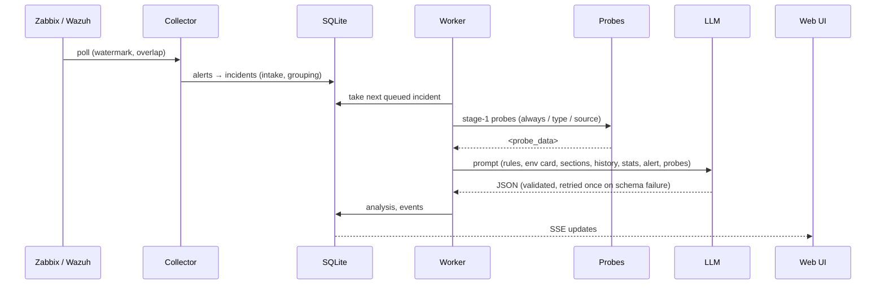

# Architecture

This document describes how Incident Analyst is put together, in the order data flows through it. Configuration keys are quoted as `section.key` of `config/analyzer.yaml`; the comments in that file say what each value means.

## 1. Goal and boundaries

* Input: alerts from **Zabbix** (problems) and **Wazuh** (indexer alerts).
* Output: for each *incident* a JSON analysis — summary, classification (kind, urgency), up to 3 probable causes with evidence, impact, up to 5 **read-only** recommended checks, correlation, unknowns, `needs_human_decision`.
* The system proposes; it never executes changes. Operators can trigger read-only probes from the UI, mark analyses as useful/not, and register *cases* that are fed back as examples.

## 2. Components and data flow

### 2.1 Collectors (`tia/collectors`)
* Zabbix: `problem.get` filtered by severity, paged; resolved problems close incidents. Wazuh: indexer search by `timestamp` with a tiebreak field, level threshold and *named rules* that always count.
* Each source keeps a watermark/cursor in `collector_state`; failures back off exponentially, authentication failures wait longer; responses are size-limited.

### 2.2 Intake and grouping (`tia/intake.py`, `tia/grouping.py`, `tia/type_rules.py`)
* Alerts are normalised (`Alert`), typed by `config/type-rules.yaml` (component tags, item key prefixes, Wazuh rule ids/groups).
* Recurrence within `intake.recurrence_window_sec` reopens, later alerts become follow-ups, resolved alerts after `skip_resolved_after_sec` are skipped.
* Storms (`grouping.storm_count` in `storm_window_sec`) and outages of `grouping.root_host` (the router everything depends on) become *group* incidents with members.

### 2.3 Queue and worker (`tia/queue.py`, `tia/analysis/worker.py`)
* A SQLite queue with retry delays (`queue.retry_delays_sec`). Validation and length failures are not retried; connection and HTTP 5xx errors back off (`worker.backoff_*`).
* Progress (received chunks) is stored so the UI can show "推論中" with a meter.

### 2.4 Knowledge (`tia/knowledge`) — see [knowledge.md](knowledge.md)
* `tia knowledge build` splits Markdown into sections, computes token estimates, scans for secrets, writes a versioned *bundle* (`current` symlink/pointer).
* The *environment card* is a fixed set of sections; per incident, sections are *selected* by host alias, incident type and title terms within a token budget.

### 2.5 Probes (`tia/probes`) — see [probes.md](probes.md)
* Catalogue `config/probes.yaml`: `where: host|zabbix|wazuh`, fixed command, roles, `when` conditions, per-probe timeout and output cap.
* Stage 1 (before inference) runs the probes matching `when`; operators may run others from the UI ("実行"). Results are stored in `probes` and rendered as `<probe_data>`.

### 2.6 Analysis context (`tia/analysis/context.py`)
Budgeted parts, in order: rules (`context.rules_budget_tokens`), environment card, selected sections, recent incidents of the same host (`context.history_*`), statistics of the same fingerprint (`context.stats_*`), registered cases (`context.cases_*`), then the dynamic part (alert payload, probe output). Total ≤ `context.input_budget_tokens`, with `context.token_margin_percent` safety margin; `input + llm.max_tokens ≤ llm.context_tokens` is enforced at config load.

### 2.7 Validation (`tia/analysis/validate.py`, `commands.py`)
* The answer must match the schema; counts and enumerations are checked; one retry at `llm.retry_temperature`.
* Every recommended command is parsed (including the inner command of `docker exec`, `ssh`, `vmctl vm exec`, `xargs`, `sh -c`, `find -exec`) and rejected if it matches a destructive pattern (service/container operations, file writes, firewall/network changes, reboot, inline code…). Commands that appear in the knowledge documents are marked as *documented*.

### 2.8 Web UI (`tia/web`)
* FastAPI + Jinja2 + HTMX 2, server-sent events for live updates, no external requests from the browser (fonts and HTMX are vendored).
* Authentication is delegated to Caddy (basic auth); the app checks `Origin`/`Host` on state-changing requests and uses a per-session CSRF token.
* `/healthz` returns 200 when the service is ready, 503 while starting or degraded (LLM unreachable, stale bundle, low disk).

### 2.9 Ops (`tia/ops`)
* `tia run` starts collectors, worker and web in one process with a stop signal and a 25-second grace period.
* `tia backup` writes a consistent SQLite copy plus config and bundle with a manifest; `tia restore` replaces the database while the service is stopped. `tia housekeeping` applies `retention.*`.

## 3. Data model (SQLite, migrations 1–4)

Main tables: `alerts`, `alert_refs`, `incidents`, `incident_members`, `events`, `analyses`, `queue`, `collector_state`, `cases`, `feedback`, `probes`. Payloads are kept `retention.payload_days`, incidents `retention.incident_days`, skipped alerts `retention.skipped_days`.

## 4. Deployment shape — see [deployment.md](deployment.md)

One container on the monitoring host, attached to the monitoring stack's Docker network (to reach Zabbix/Wazuh by service name) and to the LLM via a reverse SSH tunnel or any reachable OpenAI-compatible URL. Caddy terminates TLS and authenticates; the container itself only listens on `127.0.0.1:38090`.

## 5. Non-goals

No automatic remediation, no write access to Zabbix/Wazuh, no agent on the probed VMs beyond sshd + the executor, no tool-calling loop with the LLM (a single prompt/answer per analysis).
