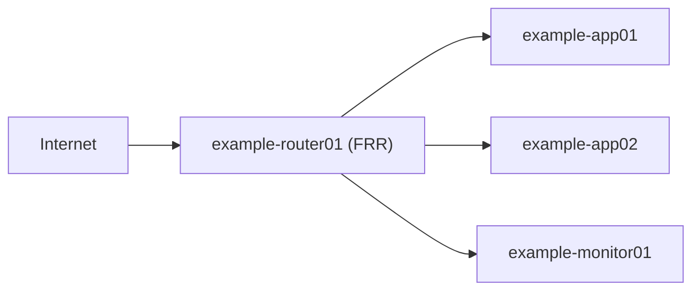

# 構成設計書（見本）

## 構成の要点

- 入口はルーター VM `example-router01`（FRR）の 1 台。公開通信はここに集まり、NAT でアプリ VM に転送する。
- 監視 VM `example-monitor01` は外へ公開しない。管理は VPN（管理経路 192.0.2.5）を経由する。
- アプリ VM `example-app01`、`example-app02`、`example-app03` は Docker Compose でサービスを動かす。
- 各 VM の既定の経路はルーター VM。ルーター VM が止まると、外向き通信と公開サービスが同時に止まる。

## 図1：全体構成

ルーター VM が経路と NAT とファイアウォールを受け持つ。

## VM台帳

| VM | IP | 役割 |
|---|---|---|
| `example-router01` | `192.0.2.4` | ルーター、NAT、FW。FRR |
| `example-app01` | `192.0.2.6` | アプリ 01。Docker Compose（`/opt/app01/docker-compose.yml`）、UDP 26900 |
| `example-monitor01` | `192.0.2.7` | 監視。Zabbix と Wazuh、Uptime Kuma、Netdata をコンテナで動かす |
| `example-app02` | `192.0.2.8` | アプリ 02。Docker Compose（`/opt/app02/docker-compose.yml`）、UDP 7777 |
| `example-app03` | `192.0.2.9` | アプリ 03。Docker Compose（`/opt/app03/docker-compose.yml`）、停止中の予備 |

## FWが守る範囲

各 VM のゲスト FW（nftables）は入力を既定で拒否する。許可は管理経路（192.0.2.5）からの SSH、監視 VM からの Zabbix agent（TCP 10050）、公開サービスのポートだけ。ルーター VM の表 `example_router_fw` は転送も既定で拒否し、公開ポートの DNAT だけを通す。

## 未解決事項

- バックアップの保管先が監視 VM の 1 か所しかない。
- アプリ VM の OS 更新は手動で、自動化していない。
