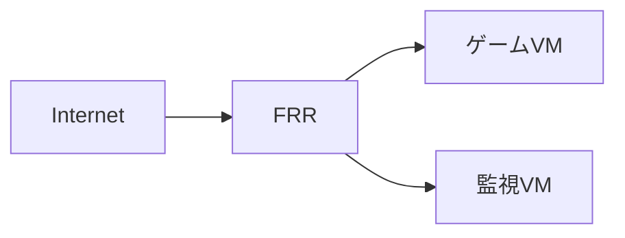

# 構成設計書

## 構成の要点

- 入口は FRR の 1 台。ゲームは UDP で公開する。
- 監視VM は外へ公開しない。管理は VPN を経由する。

## 図1：全体構成

図の説明。FRR が経路と NAT を受け持つ。

### VM台帳（実測）

| VM | IP | 役割 |
|---|---|---|
| `vm-router01` | `10.20.0.4` | ルーター、NAT、FW |
| `vm-monitor01` | `10.20.0.7` | 監視。Zabbix と Wazuh |
| `vm-game01` | `10.20.0.8` | ゲーム。UDP 7777 |

## FWが守る範囲

ゲスト FW は入力を既定で拒否する。許可は管理の経路とゲームのポートだけ。

## 未解決事項

- バックアップの保管先が 1 か所しかない。
